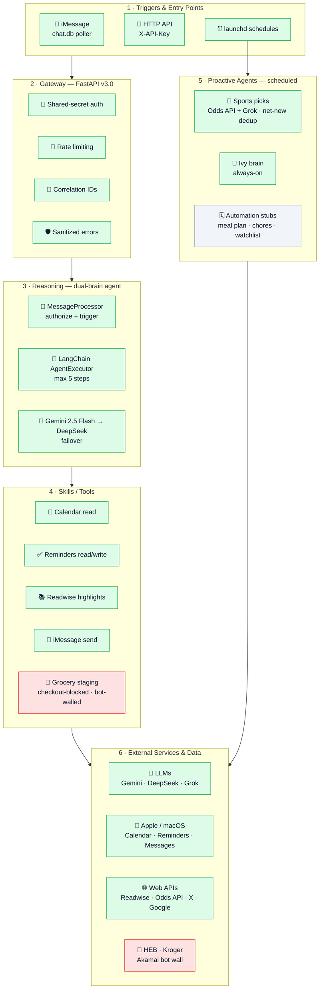

# Ivy — System Architecture & Capabilities

Local admin AI on the iMac · dual-brain (Gemini → DeepSeek) · iMessage-driven.

**Legend:** 🟩 live & verified · 🟥 blocked (external bot wall) · ⬜ planned / stub

Everything green was exercised live. The only 🟥 is grocery staging (code complete; HEB serves a bot block-page and Kroger drops the connection at the TLS/HTTP-2 layer). ⬜ items are empty `proactive_agents/` scaffolds.
