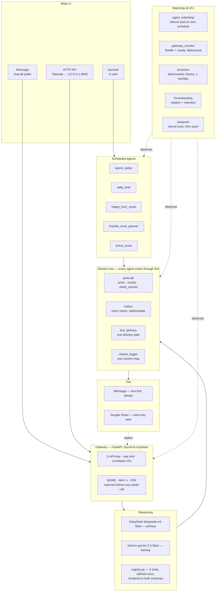
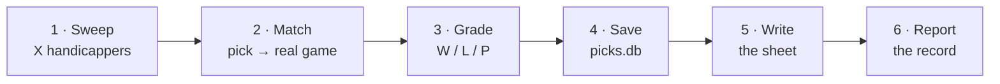

# Ivy — System Architecture

Local admin AI on the iMac. One machine, launchd, no cloud runtime and no public port.
Two ways in: iMessage, and an HTTP API reachable only across the tailnet.

**Legend:** ✅ verified against live data · ⚠️ built and tested, not yet observed working

## Shape of the system

```mermaid
flowchart TD
  subgraph IN["Ways in"]
    I1["iMessage<br/>chat.db poller"]
    I2["HTTP API<br/>Tailscale → 127.0.0.1:8000"]
    I3["launchd<br/>9 units"]
  end

  subgraph GW["Gateway — FastAPI, bound to loopback"]
    G1["X-API-Key · rate limit · correlation IDs"]
    G2["MORE · WHY n · PDF<br/>matched before any model call"]
  end

  subgraph BRAIN["Reasoning"]
    B1["DeepSeek deepseek-v4-flash — primary"]
    B2["Gemini gemini-2.5-flash — backup"]
    B3["registry.py — 5 tools, defined once,<br/>rendered to both schemas"]
  end

  subgraph AG["Scheduled agents"]
    A1["sports_bettor"]
    A2["daily_brief"]
    A3["happy_hour_scout"]
    A4["Familia_meal_planner"]
    A5["bravo_scout"]
  end

  subgraph CORE["Shared core — every agent writes through this"]
    C1["picks.db<br/>picks · results · sheet_synced"]
    C2["outbox<br/>every report, addressable"]
    C3["text_delivery<br/>one delivery path"]
    C4["sheets_logger<br/>one column map"]
  end

  subgraph OUT["Out"]
    O1["iMessage — text first, always"]
    O2["Google Sheet — read-only view"]
  end

  subgraph WATCH["Watching all of it"]
    W1["agent_watchdog<br/>silence past its own schedule"]
    W2["gateway_monitor<br/>/health + /ready, debounced"]
    W3["proactive<br/>deterministic checks, 1 text/day"]
    W4["housekeeping<br/>rotation + retention"]
    W5["autopush<br/>secret-scan, then push"]
  end

  I1 --> GW
  I2 --> GW
  GW --> BRAIN
  BRAIN --> CORE
  I3 --> AG
  AG --> CORE
  CORE --> OUT
  OUT -.->|"replies"| GW
  WATCH -.->|"observes"| CORE
  WATCH -.->|"observes"| AG
  WATCH -.->|"observes"| GW
```

## What runs when

Rendered from `deploy/launchd/*.plist.template` by `deploy/install_launchd.sh`.
The watchdog reads these same files for its thresholds rather than guessing from log
spacing — a guess would page weekly about a healthy Sunday job.

| Unit | Schedule | What it does |
|---|---|---|
| `com.ivy.gateway` | KeepAlive, RunAtLoad | FastAPI + iMessage poller |
| `com.ivy.gateway_monitor` | every 5 min | probes `/health` and `/ready`, debounced |
| `com.ivy.autopush` | every 15 min | ⚠️ secret-scans, then pushes what a human committed |
| `com.ivy.sharppicks` | 09:00 · 15:00 · 21:00 | sweep, validate, deliver picks |
| `com.ivy.daily_brief_morning` | 07:30 | weather, markets, news, Readwise |
| `com.ivy.daily_brief_evening` | 17:30 | market close and the day's news |
| `com.ivy.housekeeping` | 04:30 | log rotation, retention |
| `com.ivy.familia_meal_planner` | Sundays 08:00 | meal plan + Reminders write |
| `com.ivy.happy_hour_scout` | Sundays 12:00 | ✅ runs Sundays — `Weekday 0`, not stalled |

## Ways in, and the network posture

`main.py` and `com.ivy.gateway.plist.template` both bind uvicorn to `127.0.0.1`.
Nothing listens on the LAN or the internet. Tailscale proxies tailnet traffic to that
loopback port, so the tailnet is the only route in and the shared-secret key sits behind
that boundary rather than instead of it.

**Gap:** nothing in this repo sets up or asserts the tailnet route — no script, no plist,
no key in `.env`. It is machine state only. A rebuilt Mac would silently lose the sole
way in, and `monitor_gateway.py` would stay green throughout, because it probes
`127.0.0.1`. Worth either a deploy step that asserts `tailscale serve`, or a monitor probe
against the tailnet address.

Inbound reply commands — `MORE`, `WHY <n>`, `PDF` — are matched deterministically in
`main.py` before any model is called, so a reply costs nothing and cannot be hallucinated.

Routes: `/health` `/ready` `/capabilities` `/version` `/jobs` `/run-job` `/executions`
`/cache-stats` `/imessage/attachments` `/voice/*`.

## Reasoning

DeepSeek `deepseek-v4-flash` primary, failing over to Gemini `gemini-2.5-flash`
(`ivy_core/llm.py`). Tools are declared once in `registry.py` and rendered to each
provider's schema by `to_deepseek_schema()` and `to_gemini_declarations()` — the two
providers cannot drift apart because there is only one definition to drift from.

Five tools: `check_apple_calendar`, `fetch_readwise_highlights`, `fetch_apple_reminders`,
`add_apple_reminder`, `run_job`.

Models never produce figures. Weather, index closes and headlines are parsed from their
source and printed; the model writes prose around them.

## The pick pipeline

The deepest path in the system, and the one that was rebuilt. A pick crosses six stages
between a handicapper's post and a number on the dashboard:

```mermaid
flowchart LR
  P1["1 · Sweep<br/>X handicappers"] --> P2["2 · Match<br/>pick → real game"]
  P2 --> P3["3 · Grade<br/>W / L / P"] --> P4["4 · Save<br/>picks.db"]
  P4 --> P5["5 · Write<br/>the sheet"] --> P6["6 · Report<br/>the record"]
```

Stages 2–6 each carried a defect that raised no error. Team names lost their spaces, so
no multi-word team ever matched. Scores were read by position rather than by name, so an
away-first feed inverted every result. One malformed pick raised before the commit and
lost the whole batch. The grade went to column K while the summary read J. Consensus
picks were filed under a composite name, crediting neither real handicapper.

All fixed, each pinned by a test that fails against the original code. Grading now
reaches any date through `ivy_core/historical_scores.py` (ESPN scoreboards, no key
required) rather than being capped at the odds provider's three-day window. The record
counts distinct bets rather than mentions, and withholds a hit rate below 20 decided
games.

Rules the pipeline now enforces: a write reports whether it landed; a grade that fails to
reach the sheet is recorded as diverged and queryable later; an unmatched game or missing
score stays ungraded, because a wrong result reads exactly as confidently as a right one.

## Shared core

`ivy_core/` — every agent writes through these rather than carrying its own copy.

| Module | Responsibility |
|---|---|
| `agent_watchdog` | notice when a scheduled agent stops firing, and say so |
| `attachment_verify` | read back from `chat.db` to confirm an attachment actually sent |
| `env` | fail-closed environment access for standalone job scripts |
| `historical_scores` | scores for games older than the odds provider will serve |
| `llm` | DeepSeek primary, Gemini backup |
| `messaging` | iMessage send via argv-based AppleScript, not string interpolation |
| `outbox` | durable outbox for report delivery |
| `pick_stats` | shared vocabulary for pick records — one definition of a record |
| `picks_tracker` | wins, losses, pushes, and DB↔sheet sync state |
| `pipeline_status` | pipeline status and error handling for Sharp Picks |
| `proactive` | what Ivy says without being asked, and the budget on saying it |
| `receipts` | persistent execution receipts — did this job actually run |
| `report_fallback` | delivery receipts and user-facing fallback |
| `result_updater` | automated result tracking |
| `sheets_logger` | one authoritative column map, one spreadsheet id, one tab |
| `text_delivery` | text-first delivery for every job |

## Proactive notifications

`ivy_core/proactive.py` runs deterministic checks — sheet behind database, picks aging
out, logs growing unchecked, no qualifying picks recently, commits not pushed — and is
budgeted: one ordinary message a day, nothing between 22:00 and 07:00, repeats suppressed
for 24 hours. Criticals bypass the budget. A channel that cries wolf stops being read.

## Honest status

✅ **Verified against live data.** Grading end to end — 20 historical picks graded off
ESPN, names matched, results written. Text-first delivery and deterministic replies.
Divergence detection, which caught a real Sheets 503 and reconciled on the next run.
Reminders writes, after a slow-path fix and a list-resolution fix. 1,024 tests passing,
4 skipped, across 34 test files; ruff clean under the version CI pins.

⚠️ **Built and tested, not yet observed working.** The daily brief's weather and market
blocks — parsers tested against recorded shapes only. Unattended push, installed but not
yet run under launchd. Proactive notifications — the budget is tested, the first real text
has not gone out.

The distinction is the point. Everything in the verified column failed at least once
before it worked, and the gap between "tested" and "observed working" is where every
defect in this project has lived.

## No longer here

- `com.ivy.brain` — the always-on daemon, retired. Nothing schedules or monitors it.
- Grocery cart automation — removed 2026-09-05. It was bot-walled, no code path had
  called it in months, and it was the only reason retail credentials sat in `.env`.
- Pick pricing — `ENABLE_PICK_PRICING = False` in `proactive_agents/sports_bettor.py`.

## Scale

49 Python modules outside tests, 34 test files, 1,024 tests. Five scheduled agents,
16 shared-core modules, nine launchd units, two LLM providers, one machine.
